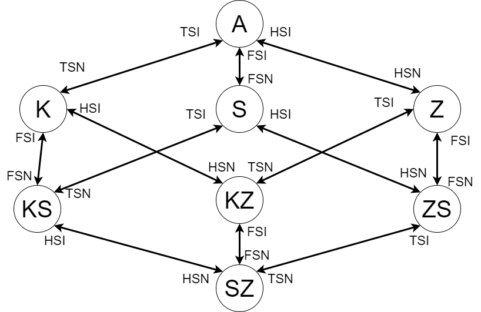

# Funkcionális specifikáció
## 1. Vágyálomrendszer leírása:
A projektrünk egy növény gondozó/figyelő rendszer amely segítségével fenntarthatjuk a virágaink, növényeink számára megfelelő életkörülményeket. A hőmérséklet érzékelő, fényérzékelő és talajnedvesség érzékelővel figyelemmel követhezjük a körülmények alakulását.
Nem megfelelő létszükségletek esetén a ledek illetve a szirénarandszer figyelmezteti a felhasználót a változtatásra.
## 2. Alkatrész lista:
- Arduino Uno R3
- hőmérséklet-érzékelő (TMP36)
- szórtfény-érzékelő (fototranzisztor)
- talajnedvesség érzékelő
- lcd kijelző (MCP23008-alapú, 32 LCD 16 x 2 (I2C))
- hangszóró (Piezo)
- 1 színű ledek a megfigyeléshez:
  - kék
  - sárga
  - zöld
- 1 színű ledek a szirénázáshoz:
  - kék
  - piros  
- ellenállások ledekhez
- jumper kábelek
## 3. Használati esetek (működés):
- A kijelzőn folyamatosan figyelemmel követhetjük a hőmérséklet, fény és talajnedvesség adatokat.
- A kék led kigyullad amennyiben a talajnedvesség nem megfelelő.
- A sárga led kigyullad amennyiben a fény nem megfelelő. 
- A zöld led kigyillad amennyiben a hőmérséklet nem megfelelő.
- Sziréna indul -> nagy a baj
## 4. Képernyőtervek (sematikus rajz és CAD tervrajz):
### 4.1: Sematikus rajz:

### 4.2: Tinkercad tervrajz:

## 5. Forgatókönyvek (állapotátmenet gráf)

### 5.1 Állapotok jelölése:
- A: alapállapot (mind a három led világít)
- K: kék talajnedvesség megfigyelő led nem világít
- S: sárga fény megfigyelő led nem világít
- Z: zöld hőmérséklet megfigyelő led nem világít
- KS: kék talajnedvesség megfigyelő és sárga fény megfigyelő led nem világít
- KZ: kék talajnedvesség megfigyelő és zöld hőmérséklet megfigyelő led nem világít
- ZS: zöld hőmérséklet megfigyelő és sárga fény megfigyelő led nem világít
- SZ: sziréna indul (egyik led sem világít - nagy baj)

### 5.1 Állapot átmenetek jelölése:
- TSN: talajnedvesség szenzor nem megfelelő értéket mér
- TSI: talajnedvesség szenzor megfelelő értéket mér
- FSN: fény szenzor nem megfelelő értéket mér
- FSI: fény szenzor nem megfelelő értéket mér
- HSN: hőmérésklet szenzor nem megfelelő értéket mér
- HSI: hőmérésklet szenzor nem megfelelő értéket mér

### 5.2 Állapotátmenet gráf:

